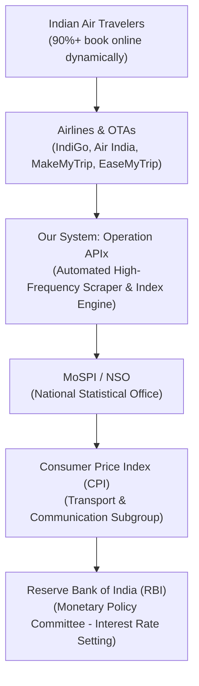
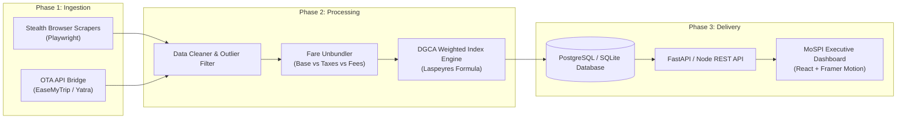
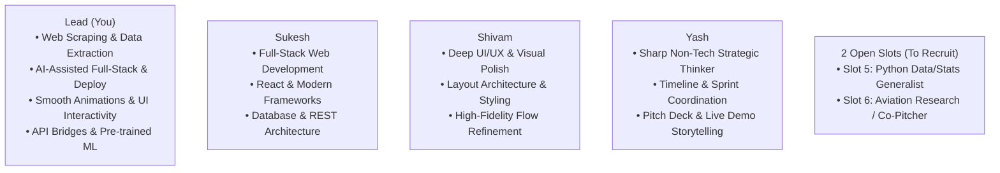
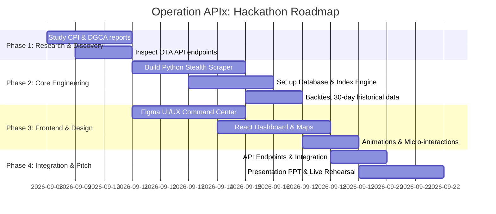

# ✈️ Operation APIx: Real-Time Airfare Price Index for India
## Complete 15–20 Minute Team Master Guide & Obsidian Blueprint
### Smart India Hackathon (SIH 2026) | Problem Statement: SIH26056 (MoSPI)

> [!IMPORTANT]
> **Speaker Note (0:00 - 1:00)**:  
> *“Team, we are not here to build another flight booking website. We are here to solve a multi-billion rupee blind spot for the Reserve Bank of India and the Ministry of Statistics. Right now, there are **0 other teams** competing against us on this problem statement. Here is why this is our ticket to winning SIH 2026.”*

---

## 📖 Chapter 1: The Story & The Hook (The Blind Spot)

Imagine it is the Friday before Diwali. Millions of Indian citizens are rushing to book flights from Delhi to Mumbai, or Bangalore to Patna. 
On **MakeMyTrip**, an IndiGo or Air India ticket that normally costs ₹4,500 is surging dynamically to ₹18,000 within three hours. Dynamic algorithms adjust the price every two minutes based on seat inventory, fuel surcharges, and click velocity.

Now, imagine what the Government of India is doing at the exact same moment to calculate national inflation:
A government statistical officer with a pen and a clipboard walks into an Air India physical ticketing office in Connaught Place, New Delhi. He asks the clerk behind the desk: 
> *"What is the standard fare for Delhi to Mumbai today?"*

He writes down a fixed base fare number on paper. He does this **once a month**.

### Why This is an Economic Catastrophe:
1. **92% of domestic air tickets in India are sold online** via OTAs (MakeMyTrip, EaseMyTrip, Yatra, Cleartrip) and airline portals—not physical ticketing counters.
2. The **Reserve Bank of India (RBI)** sets the country's interest rates (repo rate) based on the **Consumer Price Index (CPI)**.
3. Because airfare inflation is collected manually once a month from physical counters, **the national inflation numbers completely miss dynamic price surges, surge pricing, festival price gouging, and seasonal volatility.**
4. When national data is wrong, the RBI makes monetary policy decisions with blinders on.

> [!NOTE]
> Under the newly revised **CPI Series (Base 2024=100)**, MoSPI has officially mandated that air travel must be tracked using **digital, high-frequency online sources**. They literally posted **SIH26056** because they do not have the automated software platform to do it!

---

## 🏛️ Chapter 2: The Stakeholders — Who They Are & What They Need

### 1. MoSPI (Ministry of Statistics and Programme Implementation)
* The official sponsor of this problem statement.
* Responsible for compiling and publishing India’s official macroeconomic indicators (CPI, GDP, IIP).

### 2. NSO (National Statistical Office)
* The technical statistical wing under MoSPI.
* They need an automated software tool that generates an **Airfare Price Index (APIx)** on a daily, weekly, and monthly basis so their statisticians don’t have to do manual data collection.

### 3. RBI (Reserve Bank of India)
* The ultimate consumer of the data.
* Under India’s **Flexible Inflation Targeting (FIT)** framework, the RBI is legally mandated to keep consumer inflation at **4% (±2%)**. Accurate transport inflation numbers are critical for setting national interest rates.

### 4. DGCA (Directorate General of Civil Aviation)
* The aviation regulator that tracks passenger traffic volume on every domestic city-pair in India.
* We use DGCA passenger volume data to assign weights to flight routes (e.g. Delhi–Mumbai gets more weight than Varanasi–Bhopal).

---

## 🎯 Chapter 3: What Is The Real Solution? (What We Are Building)

We are building **"Operation APIx"**: A high-frequency, resilient data platform that scrapes, cleans, weights, and visualizes air travel inflation across India in real time.

### The 4 Pillars of Our Solution:

#### 1. The Multi-Source Ingestion Engine
* Automatically monitors the **Top 10–15 DGCA Domestic City-Pairs** (e.g., DEL-BOM, DEL-BLR, BOM-BLR, DEL-CCU, BLR-HYD, MAA-DEL).
* Tracks **5 Advance Booking Windows**:
  - **$T+1$ Day**: Last-minute travel (measures emergency / business pricing).
  - **$T+7$ Days**: Short-notice travel.
  - **$T+15$ Days**: Mid-range booking.
  - **$T+30$ Days**: Standard advance planning.
  - **$T+45$ Days**: Holiday / early booking baseline.
* Pulls prices across all major domestic carriers: **IndiGo, Air India, Air India Express, Akasa Air, SpiceJet**.

#### 2. The Data Normalization & Cleaning Pipeline
* **Separates Unbundled Fare Components**: Extracts pure **Base Fare** (which reflects true airline pricing behavior) away from government taxes (GST), User Development Fees (UDF), Passenger Service Fees (PSF), and OTA convenience charges.
* **Outlier Removal**: Uses interquartile range (IQR) to discard anomalous fares (e.g. mispriced business class seats or glitch fares).
* **Sold-Out Handling**: Imputes values when flights on a sector are completely booked out.

#### 3. The DGCA Weighted Index Engine (APIx Formula)
Using the globally recognized **Laspeyres Price Index Formula**:
$$\text{APIx}_t = \sum_{i=1}^{n} \left( \frac{P_{i,t}}{P_{i,0}} \times W_i \right) \times 100$$
* $P_{i,t}$: Current average price for route $i$ at time $t$.
* $P_{i,0}$: Base period average price for route $i$ (normalized to 100).
* $W_i$: Route weight based on DGCA domestic passenger traffic share (e.g., DEL–BOM accounts for ~14.2% of national traffic, so $W_{\text{DEL-BOM}} = 0.142$).

#### 4. The MoSPI Executive Command Center & RBI API
* **Executive Inflation Gauge**: Shows today's Airfare Inflation rate (e.g. `APIx: 106.4 | +6.4% MoM`).
* **Interactive 3D/2D Flight Route Heatmap**: Real-time India corridor map showing routes surging in red vs. stable routes in green.
* **Lead-Time Elasticity Curve**: A graph showing how prices spike as the departure date approaches ($T+45 \to T+1$).
* **Government Open API**: Secure REST API endpoints for NSO statisticians and RBI economists:
  - `GET /api/v1/apix/summary`
  - `GET /api/v1/apix/route?sector=DEL-BOM&window=T7`

---

## ⚡ Chapter 4: Our Team Superpowers — The "X" Factor

Here is why our team is uniquely built to dominate this exact challenge:

| Team Member | Superpower | Exact Role in Operation APIx |
| :--- | :--- | :--- |
| **Lead (You)** | **Scraping, AI Full-Stack, Animations, Deployment** | Build the stealth Playwright scraper & API bridges; implement the Laspeyres index calculation engine; build interactive UI animations; handle cloud deployment (Vercel/Render). |
| **Sukesh** | **Full-Stack React & Backend Architecture** | Architect the React application state; design PostgreSQL/SQLite database models; build FastAPI/Express REST endpoints for the dashboard and RBI API. |
| **Shivam** | **Deep UI/UX Design & Aesthetic Polish** | Design an award-winning Government Intelligence Command Center; craft color palettes, typography, responsive dashboards, and interactive India airport route flows. |
| **Yash** | **Strategic Coordination & Pitch Narrative** | Ensure the team hits preparation milestones; craft the 15-minute presentation deck; choreograph the live judge demo; rehearse Q&A on why manual surveys fail. |
| **Open Slot 1** | **Data / Python Generalist** | Assist with DGCA historical data curation, backtesting against DGCA monthly fare reports, and validation checks. |
| **Open Slot 2** | **Domain Researcher / Co-Speaker** | Study MoSPI CPI guidelines and DGCA tariff rules to assist Yash in answering tough judge questions during Q&A. |

---

## 🛠️ Chapter 5: How We Bypass The "Bot & Captcha" Barrier

> [!TIP]
> **Speaker Note for Sukesh & Yash**:  
> *“Airlines have bot-protection, but we don’t need to hack into mainframes. We have a 3-tier strategy that is 100% reliable.”*

1. **The Chrome Network Tab Method (Internal OTA APIs)**:
   - Aggregator websites like EaseMyTrip, Yatra, or Ixigo load flight search results via internal asynchronous JSON calls (`Fetch/XHR`).
   - We inspect these requests in Chrome DevTools, extract the clean JSON payload, and replicate the headers. This completely avoids parsing messy HTML DOMs.
2. **Stealth Headless Automation**:
   - For websites requiring JavaScript execution, we use **Python `playwright-stealth`**, which masks headless browser fingerprints and mimics human mouse movements and user-agents.
3. **The "Fail-Safe" Hackathon Demo Architecture**:
   - We pre-populate our database with **30 days of historical airfare data** for our routes.
   - The React dashboard reads from this fast database during the live presentation so the UI is instantaneous and completely immune to live network lags.
   - We include a dedicated **"Live Query Sandbox"** button on the UI to demonstrate a live scrape of 1 route in real time to prove the ingestion engine works!

---

## 📚 Chapter 6: The Team Study Syllabus & Curated Resources

Since our team currently only knows how to book a flight ticket, here is our 5-topic curriculum:

### 1. Understanding India’s Consumer Price Index (CPI) & Inflation
* **What to Learn**: What is CPI? How does the "Transport & Communication" subgroup factor into inflation? Why is MoSPI shifting to digital price collection under Base 2024=100?
* **Key Resources**:
  - [MoSPI Official CPI Portal](https://mospi.gov.in) — Explains CPI Urban, Rural, and Combined.
  - [MoSPI eSankhyiki Portal](https://esankhyiki.mospi.gov.in) — National data repository.
  - [RBI Monetary Policy Framework Explained](https://www.rbi.org.in/scripts/FS_Overview.aspx?fn=2752) — Explains the 4% inflation target.
  - [PIB Release: CPI Base Revision (2024=100)](https://pib.gov.in) — Details the inclusion of digital services and airfare.

### 2. Aviation Economics & DGCA Route Statistics
* **What to Learn**: What are the top 10 busiest city pairs in India? How does passenger volume determine route weights? What is DGCA tariff monitoring?
* **Key Resources**:
  - [DGCA Monthly Domestic Passenger Traffic Reports](https://www.dgca.gov.in) — Download the latest monthly report to get exact passenger counts for DEL-BOM, DEL-BLR, etc.
  - [DGCA Air Tariff Monitoring Cell](https://www.dgca.gov.in) — Understand unbundled fares (Base fare vs UDF vs PSF).

### 3. Price Index Mathematical Formulations
* **What to Learn**: The Laspeyres Price Index vs. Paasche Index vs. Jevons Geometric Mean.
* **Key Resources**:
  - [IMF Consumer Price Index Manual (Theory and Practice)](https://www.imf.org/en/Publications/Manuals-Guides/Issues/2020/11/23/Consumer-Price-Index-Manual-49887) — Chapter on Index Number Formulas.
  - Formula to master:
    $$\text{Index}_t = \frac{\sum (P_{i,t} \cdot Q_{i,0})}{\sum (P_{i,0} \cdot Q_{i,0})} \times 100$$

### 4. Airline Dynamic Pricing & Fare Buckets
* **What to Learn**: How Yield Management Systems work; why tickets jump in price across booking horizons ($T+1, T+7, T+30$); difference between economy buckets (RBDs - Reservation Booking Designators).
* **Key Resources**:
  - Article: *"How Airline Dynamic Pricing Works: From Revenue Management to AI Algorithms"* (MIT Airline Industry Program).

### 5. Stealth Web Scraping & Data Engineering
* **What to Learn**: Playwright for Python, handling session cookies, anti-fingerprinting with `playwright-stealth`, asynchronous scheduling with Celery / APScheduler.
* **Key Resources**:
  - [Playwright Python Documentation](https://playwright.dev/python/docs/intro)
  - [Scrapy Framework Guide](https://docs.scrapy.org/en/latest/)
  - GitHub: `playwright-stealth` repository.

---

## 🗓️ Chapter 7: Phase-by-Phase Execution Roadmap

---

## 🏆 Final Summary Checklist For Our Team

- [ ] **Problem Identified**: Outdated manual surveyor collection fails to capture 90%+ dynamic online flight pricing.
- [ ] **Our Target User**: MoSPI statisticians compiling the CPI & RBI economists setting interest rates.
- [ ] **Our Solution**: Automated ingestion engine + DGCA weighted Laspeyres index + Executive Command Center Dashboard + RBI API.
- [ ] **Our Unfair Advantage**: 0 competing teams on SIH26056, perfect match for scraping + React + UI/UX animations + AI acceleration.
- [ ] **Immediate Next Step**: Build the interactive frontend presentation to walk the entire team through this vision.
