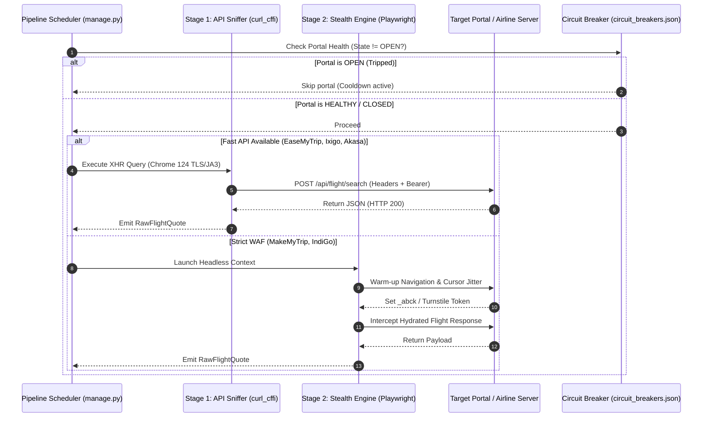
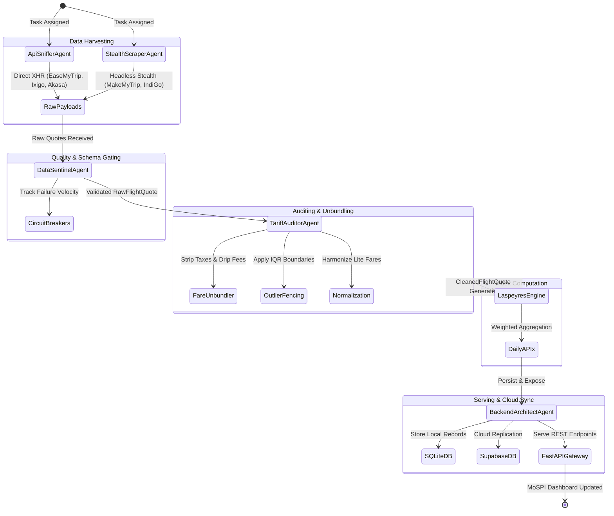
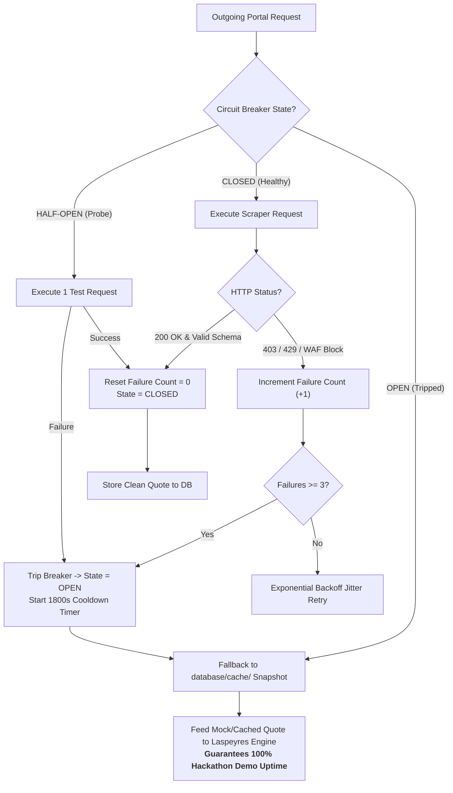
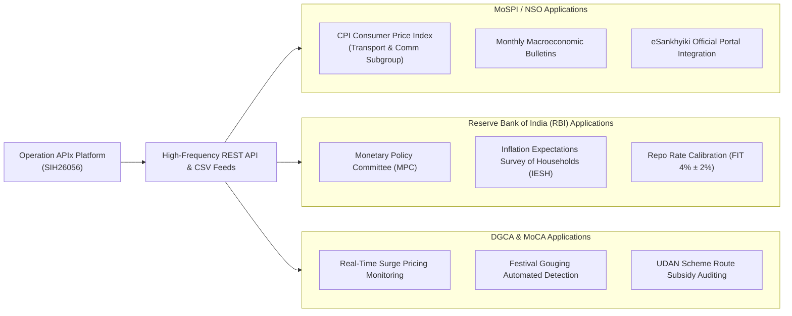

# 🏗️ Operation APIx: Master End-to-End System Architecture
### Comprehensive Technical Architecture Covering All 11 Portals, 12 Corridors, 5 Horizons & 15 Aviation Edge Cases
**Project**: Operation APIx (SIH26056 - Ministry of Statistics and Programme Implementation)  
**Stakeholders**: MoSPI / NSO, Reserve Bank of India (RBI), Directorate General of Civil Aviation (DGCA)  
**Status**: Phase 3 Ready & Production Blueprint | **Date**: September 9, 2026

---

## 🏛️ 1. Global High-Level Architecture Overview

```mermaid
flowchart TB
    subgraph SOURCELAYER["🌐 1. MULTI-PORTAL INGESTION TARGETS (11 Portals)"]
        subgraph AIRLINES["Direct Airline Carriers (5)"]
            A1["IndiGo (6E)<br/><i>Navitaire DotRez / Akamai</i>"]
            A2["Air India (AI)<br/><i>Amadeus Altéa / Akamai</i>"]
            A3["Air India Express (IX)<br/><i>Navitaire / Cloudflare</i>"]
            A4["Akasa Air (QP)<br/><i>Navitaire DotRez REST</i>"]
            A5["SpiceJet (SG)<br/><i>Navitaire DotRez</i>"]
        end
        subgraph OTAS["Online Travel Agencies (6)"]
            O1["EaseMyTrip<br/><i>Clean REST / ₹0 Fee</i>"]
            O2["MakeMyTrip<br/><i>Encrypted XHR / Akamai</i>"]
            O3["Ixigo<br/><i>REST API / Turnstile</i>"]
            O4["Yatra<br/><i>JSON XHR / CSRF</i>"]
            O5["Cleartrip<br/><i>REST / Paise Scale</i>"]
            O6["Goibibo<br/><i>MMT Platform Engine</i>"]
        end
    end

    subgraph HARVESTER["⚡ 2. TWO-STAGE EXTRACTION & EVASION ENGINE"]
        direction TB
        subgraph STAGE1["Stage 1: API Sniffer Engine (curl_cffi)"]
            S1_1["Chrome 124 TLS/JA3 Fingerprint Impersonation"]
            S1_2["Session Handshake & JWT Bearer Harvester"]
            S1_3["Sub-second Direct JSON Extraction (<800ms)"]
        end
        subgraph STAGE2["Stage 2: Stealth Browser Engine (Playwright)"]
            S2_1["Headless Chromium + playwright-stealth"]
            S2_2["Humanized Bezier Cursor Jitter (2.0s–4.5s)"]
            S2_3["Akamai _abck Sensor & Turnstile Token Resolver"]
        end
        subgraph RESILIENCE["Resilience, Fallbacks & Governance"]
            CB["Circuit Breakers (state/circuit_breakers.json)<br/><i>Trip: 3 Fails | 1800s Cooldown</i>"]
            COMM_FALLBACK["Commercial API / Web Unlocker Fallback (Bright Data / SerpApi)<br/><i>Automated Failover on HTTP 403 / Strict CAPTCHA</i>"]
            PROXY["Smart Proxy & Session Cookie Pool"]
            RATE["Adaptive Rate Limiter (2.0s–4.0s Jitter)"]
        end
    end

    SOURCELAYER --> HARVESTER

    subgraph NORMALIZER["🛡️ 3. TARIFF AUDITING & 15-EDGE-CASE NORMALIZATION PIPELINE"]
        direction TB
        RAW_SCHEMA["Pydantic v2 Ingestion: RawFlightQuote"]
        
        subgraph EC_FILTERS["The 15 Edge Case Normalization Filters"]
            direction TB
            EC_TAX["EC-3 & EC-1: Pure Economic Fare Unbundling<br/><code>Base Fare + Fuel Surcharge (YQ)</code><br/><i>Strip UDF, PSF, ASF, CUTE, GST & OTA Convenience Fees</i>"]
            EC_LITE["EC-2: 'Lite' Baggage Isolation & Harmonization<br/><i>Harmonize 7kg Cabin-Only (R07LGT) to Standard 15kg (R07SAV)</i>"]
            EC_ROUTING["EC-8 & EC-9: Non-Stop Strict Filter & Airport Resolvers<br/><code>is_non_stop = True AND duration <= 240m</code><br/><i>Resolve BOM vs NMIA, GOI vs GOX</i>"]
            EC_OUTLIER["EC-7: IQR Price Outlier Bounding<br/><code>[max(1500, Q1 - 1.5*IQR), min(35000, Q3 + 2.5*IQR)]</code><br/><i>Filter Business Class Leaks & ₹0 Glitch Fares</i>"]
            EC_TECH["EC-10, 11, 15: Technical Sanity Rectifiers<br/><i>Asia/Kolkata Enforced, Paise/100 Rescaling, ISO-8601 Dates</i>"]
            EC_SURVIVOR["EC-5 & EC-6: Inventory & Sold-Out Hedonic Imputer<br/><i>Compensate T+1 Distressed Inventory Depletion</i>"]
        end

        CLEAN_SCHEMA["Pydantic v2 Output: CleanedFlightQuote"]
        SENTINEL["pipeline/sentinel.py: Quality Gate & Schema Drift Guardian"]
        
        RAW_SCHEMA --> EC_FILTERS --> CLEAN_SCHEMA --> SENTINEL
    end

    HARVESTER --> NORMALIZER

    subgraph STATS["📈 4. DGCA PASSENGER-WEIGHTED LASPEYRES INDEX ENGINE"]
        direction TB
        LASP["engine/laspeyres.py: Laspeyres Algorithm<br/><code>APIx_t = SUM( W_i * (P_it / P_i0) ) * 100</code>"]
        WEIGHTS["DGCA Passenger Volume Weights (W_i)<br/><i>12 Corridors Sum = 1.000 (Base 2024 = 100)</i>"]
        HORIZONS["Multi-Horizon Aggregator<br/><i>T+1, T+7, T+15, T+30, T+45</i>"]
        
        WEIGHTS --> LASP
        HORIZONS --> LASP
    end

    NORMALIZER --> STATS

    subgraph STORAGE["💾 5. DUAL-TIER PERSISTENCE & FAIL-SAFE LAYER"]
        LOCAL_DB[("Local SQLite 3 WAL<br/>database/apix.db<br/><i>5,580 Quotes / 31 Days Seeded</i>")]
        CLOUD_DB[("Production Supabase<br/>Managed PostgreSQL<br/><i>Zero-code SQL toggle in db.py</i>")]
        CACHE[("Fail-Safe Replay Cache<br/>database/cache/*.json<br/><i>100% Hackathon Demo Guarantee</i>")]
    end

    NORMALIZER --> STORAGE
    STATS --> STORAGE

    subgraph SERVING["🚀 6. SERVING & EXECUTIVE COMMAND CENTER"]
        direction TB
        API["FastAPI Asynchronous REST Gateway (backend/main.py)<br/><code>/api/v1/apix/summary</code> | <code>/api/v1/apix/routes</code> | <code>/api/v1/apix/elasticity</code>"]
        DASHBOARD["MoSPI Executive Command Center (React + Vite + Tailwind)<br/><i>Interactive Route Heatmaps, Yield Elasticity Curves, Inflation Alarms</i>"]
        CLI["Master CLI (manage.py)<br/><code>status | init-db | seed-mock | compute-index | audit | serve</code>"]
        
        API --> DASHBOARD
    end

    STORAGE --> SERVING

    subgraph CONSUMERS["🏛️ 7. NATIONAL STAKEHOLDERS & DOWNSTREAM CONSUMPTION"]
        MOSPI["Ministry of Statistics & Programme Implementation (MoSPI)<br/><i>National CPI Index Compilation (Transport Subgroup)</i>"]
        RBI["Reserve Bank of India (RBI)<br/><i>Monetary Policy Committee - Repo Rate & Inflation Targeting</i>"]
        DGCA["Directorate General of Civil Aviation (DGCA)<br/><i>Air Tariff Monitoring & Surge Pricing Regulation</i>"]
    end

    SERVING --> CONSUMERS
```



---

## 🔍 2. Deep Component Architecture & Pipeline Mechanics

### Layer 1: Ingestion Targets (The 11 Portals)
The system surveys 11 mandated portals across India's aviation market:

| Portal ID | Portal Name | Category | Primary Protocol | Anti-Bot Defense | Adapter Class |
| :--- | :--- | :--- | :--- | :--- | :--- |
| `easemytrip` | EaseMyTrip | OTA | JSON XHR REST | Rate Limiting | `scrapers.otas.easemytrip_scraper.EaseMyTripScraper` |
| `ixigo` | Ixigo | OTA | JSON XHR REST | Cloudflare Turnstile | `scrapers.otas.ixigo_scraper.IxigoScraper` |
| `makemytrip` | MakeMyTrip | OTA | Encrypted XHR / DOM | Akamai Bot Manager Premier | `scrapers.otas.makemytrip_scraper.MakeMyTripScraper` |
| `yatra` | Yatra | OTA | JSON XHR REST | CSRF / Session Cookies | `scrapers.otas.yatra_scraper.YatraScraper` |
| `cleartrip` | Cleartrip | OTA | JSON REST | Cloudflare / WAF | `scrapers.otas.cleartrip_scraper.CleartripScraper` |
| `goibibo` | Goibibo | OTA | Encrypted XHR | Akamai / MMT Engine | `scrapers.otas.goibibo_scraper.GoibiboScraper` |
| `indigo` | IndiGo (6E) | Airline | Navitaire DotRez REST | Akamai Bot Manager (`_abck`) | `scrapers.airlines.indigo_scraper.IndiGoScraper` |
| `airindia` | Air India (AI) | Airline | Amadeus Altéa / NDC | Akamai / Session Auth | `scrapers.airlines.airindia_scraper.AirIndiaScraper` |
| `airindia_express` | Air India Express (IX) | Airline | Navitaire DotRez | Cloudflare / Rate Limiter | `scrapers.airlines.airindia_express.AirIndiaExpressScraper` |
| `akasa` | Akasa Air (QP) | Airline | Navitaire DotRez REST | Minimal / Token Bearer | `scrapers.airlines.akasa_scraper.AkasaScraper` |
| `spicejet` | SpiceJet (SG) | Airline | Navitaire DotRez | Session Handshake | `scrapers.airlines.spicejet_scraper.SpiceJetScraper` |

---

### Layer 2: The Two-Stage Harvester Engine



---

## 🛡️ 3. Complete 15 Edge-Case Normalization Matrix

Every scraped quote passes through a strict gauntlet of 15 edge-case normalizers defined in [`EDGE_CASES_AND_DATA_NORMALIZATION_GUIDE.md`](file:///c:/Users/swaya/Downloads/SIH/EDGE_CASES_AND_DATA_NORMALIZATION_GUIDE.md):

```mermaid
flowchart LR
    subgraph INTAKE["1. INTAKE"]
        R["RawFlightQuote"]
    end

    subgraph PHASE_A["2. CIVIL TARIFFS"]
        direction TB
        E3["EC-3: Unbundle Taxes<br/><code>Base + YQ Only</code>"]
        E1["EC-1: Strip Drip Fees<br/><code>Convenience = 0</code>"]
        E2["EC-2: Harmonize Baggage<br/><code>7kg Lite -> 15kg Std</code>"]
        E4["EC-4: Ancillary Parity<br/><code>AI Meals vs LCC</code>"]
    end

    subgraph PHASE_B["3. GEOGRAPHIC & SECTOR"]
        direction TB
        E8["EC-8: Non-Stop Filter<br/><code>is_non_stop = True</code>"]
        E9["EC-9: Metro Ambiguities<br/><code>BOM/NMIA, GOI/GOX</code>"]
    end

    subgraph PHASE_C["4. YIELD & INVENTORY"]
        direction TB
        E7["EC-7: IQR Outlier Filter<br/><code>₹1,500 <= P <= ₹35,000</code>"]
        E5["EC-5: Sold-Out Imputation<br/><code>Hedonic Carry-Forward</code>"]
        E6["EC-6: RBD Elasticity<br/><code>T+1 vs T+45 Buckets</code>"]
    end

    subgraph PHASE_D["5. TECHNICAL & WAF"]
        direction TB
        E10["EC-10: Timezone Lock<br/><code>Asia/Kolkata Enforced</code>"]
        E11["EC-11: Currency Rescale<br/><code>Paise > 100k -> /100</code>"]
        E15["EC-15: Date Harmonizer<br/><code>ISO-8601 Enforced</code>"]
        E12["EC-12: Akamai _abck"]
        E13["EC-13: Turnstile Resolver"]
        E14["EC-14: PSS Protocol Map"]
    end

    subgraph OUTPUT["6. VERIFIED STORAGE"]
        C["CleanedFlightQuote"]
        DB[("database/apix.db")]
    end

    INTAKE --> PHASE_A --> PHASE_B --> PHASE_C --> PHASE_D --> OUTPUT
    OUTPUT --> DB
```



### Detailed Edge Case Rules Reference Table

| Edge Case | Category | Symptom / Risk | Exact Architectural Fix | Formula / Rule |
| :--- | :--- | :--- | :--- | :--- |
| **EC-1: Drip Pricing** | Tariffs | MMT adds ₹399–499 checkout fee; EMT ₹0. | Strip all checkout add-ons at ingestion. | $P_{\text{econ}} = P_{\text{total}} - \text{Fee}_{\text{convenience}}$ |
| **EC-2: 'Lite' Fares** | Tariffs | 7kg cabin-only creates false -15% drop. | Re-normalize to 15kg standard check-in. | If FareBasis contains `LGT` $\rightarrow$ Map to `SAV` ($+₹450$). |
| **EC-3: Tax Unbundling** | Tariffs | UDF, PSF, GST distort airline yield pricing. | Isolate pure airline price from statutory levies. | $\text{Pure Fare} = \text{Base Fare} + \text{Fuel Surcharge (YQ/YR)}$ |
| **EC-4: Ancillary Bundling** | Tariffs | Air India includes meals/bags; LCCs charge extra. | Base comparison on 15kg luggage + seat standard. | Strip extra food/seat selection bundles. |
| **EC-5: Sold-Out Bias** | Inventory | Low fares sell out on $T+1$; survivorship bias. | Hedonic regression imputation or carry-forward. | Impute missing baseline using median route multiplier. |
| **EC-6: RBD Depletion** | Inventory | 250–500% price elasticity curve across horizons. | Track separate horizon buckets ($T+1$ to $T+45$). | No cross-horizon bucket contamination. |
| **EC-7: Glitch / Business** | Inventory | ₹0 glitch fares or ₹45,000 business class leaks. | Strict Interquartile Range (IQR) gating. | $[\max(1500, Q_1 - 1.5 \cdot \text{IQR}), \min(35000, Q_3 + 2.5 \cdot \text{IQR})]$ |
| **EC-8: Layover Distortions** | Routing | 1-stop flights duplicate UDF fees and add delays. | Hard filter on non-stop flights only. | `is_non_stop == True` AND `duration_mins <= 240` |
| **EC-9: Dual-Airport Codes** | Routing | Goa (GOI vs GOX), Mumbai (BOM vs NMIA). | Macro-metro grouping with explicit airport tag. | Route pair maps to primary traffic anchor (`GOI`/`GOX`). |
| **EC-10: Midnight Red-Eyes** | Technical | UTC servers record 01:00 IST flight as day before. | Strict Indian Standard Timezone localization. | `flight_date = flight_dt.astimezone(ZoneInfo('Asia/Kolkata'))` |
| **EC-11: Paise vs Rupee** | Technical | Cleartrip returns `450000` paise instead of `4500`. | Automatic magnitude check. | If `fare > 100000` $\rightarrow$ `fare = fare / 100` |
| **EC-12: Akamai Sensor** | Anti-Bot | `_abck` cookie invalidation causes HTTP 403. | Two-stage Playwright warm-up + cookie reuse. | Maintain warm headless browser context. |
| **EC-13: Cloudflare Turnstile**| Anti-Bot | Ixigo/EMT challenge screens. | Jittered mouse trajectories + token harvest. | Backoff on challenge detection. |
| **EC-14: PSS Protocol Map** | Technical | Navitaire DotRez vs Amadeus Altéa NDC schemas. | Abstract adapters mapping to unified Pydantic model. | Single target schema: `RawFlightQuote`. |
| **EC-15: Date Format Frag** | Technical | `DD/MM/YYYY`, `YYYY-MM-DD`, `DDMMYYYY`. | Ingestion parser converts all dates to ISO-8601. | `datetime.strptime()` normalized to `YYYY-MM-DD`. |

---

## 📊 4. The 12 DGCA Corridors & Passenger Weight Matrix

The Laspeyres Index aggregates across 12 domestic corridors representing **>60% of India's domestic scheduled passenger traffic**:

```
DEL-BOM  [====================] 16.5% (Golden Quadrilateral Primary)
DEL-BLR  [===============] 12.5% (North-South Tech Corridor)
BOM-BLR  [===========] 9.5% (West-South Commercial Corridor)
DEL-CCU  [==========] 8.0% (East-West Trunk Corridor)
BLR-HYD  [=========] 7.5% (Deccan Tech Link)
MAA-DEL  [========] 7.0% (Southern Coastal Trunk)
DEL-HYD  [========] 6.5% (Capital-Deccan Link)
BOM-GOI  [=======] 6.0% (Primary Leisure & Tourism Route)
DEL-PNQ  [======] 5.5% (Automotive & IT Corridor)
BOM-CCU  [======] 5.5% (Western-Eastern Commercial Link)
DEL-GAU  [======] 5.0% (Northeastern Strategic Connectivity)
DEL-SXR  [======] 5.0% (Jammu & Kashmir High-Volatility Route)
-------------------------------------------------------------
TOTAL WEIGHT: 100.0% (1.000) | BASE YEAR: 2024 = 100
```

---

## 🤖 5. Autonomous 5-Agent Assembly Line Workflow

The system is coordinated by 5 autonomous agent personas defined in `agents/registry.json`:



---

## 🛡️ 6. Fault-Tolerance, Circuit Breakers & 100% Demo Guarantee



---

## 📈 7. Downstream Consumption & Institutional Impact



---

## 🎯 8. Definition of Done & Sprint Roadmap

- [x] **Phase 1: Project Scaffolding & Legal Eligibility** (Charter, Team, Repositories).
- [x] **Phase 2: Mathematical Engine & Mock Data** (5,580 quotes, Laspeyres index, Sentinel watchdog).
- [x] **Phase 2.5: Deep Subagent Dossiers & Edge Case Guide** (15 edge cases, 11 portal reverse engineering specs).
- [x] **Phase 2.9: Multi-Session Memory System Synchronized** (`PROJECT_MEMORY.md`, `CONVERSATION_HISTORY.md`, `DECISIONS_LOG.md`).
- [ ] **Phase 3: Core Scrapers & Ingestion Adapters** *(Active Sprint)*:
  - `scrapers/base_scraper.py` (TLS impersonation, JA3, randomized jitter).
  - `scrapers/otas/easemytrip_scraper.py` (Fast XHR API).
  - `scrapers/browser_engine.py` (Playwright stealth).
  - Direct carrier adapters (IndiGo, Air India, Akasa).
- [ ] **Phase 4: API, Verification & Command Center**:
  - FastAPI asynchronous endpoints.
  - React/Vite interactive command center.
  - 30-day historical DGCA backtesting engine.
