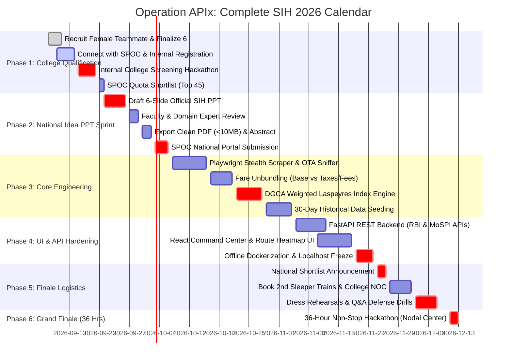

# ⏱️ Operation APIx: Master SIH 2026 End-to-End Timeline & Milestone Blueprint
### Problem Statement: SIH26056 (MoSPI) | Project: Real-Time Airfare Price Index for India
**Date of Creation**: September 8, 2026 | **Target**: December 2026 Grand Finale Victory

---

## 🗺️ Master Visual Roadmap (Gantt Overview)



---

## 🗓️ Phase-by-Phase Detailed Chronology

### 📍 Phase 1: Mobilization & College Qualification
**Dates: September 8, 2026 – September 20, 2026**  
*Goal: Ensure 100% legal eligibility, lock the mandatory female teammate, and win the college internal screening quota.*

| Exact Date | Milestone / Task | Primary Owner | Deliverable & Acceptance Criteria |
| :--- | :--- | :--- | :--- |
| **Sep 8 – Sep 11** | **Recruit Mandatory Female Teammate** | Entire Team | Lock Slot 5 with a female classmate from your college. Ensure name, department, roll number, and email match college records. |
| **Sep 10 – Sep 12** | **Recruit Slot 6 (Domain Researcher / Co-Speaker)** | Yash / Lead | Finalize 6th student to assist with DGCA air tariff regulations and co-pitching. |
| **Sep 12 – Sep 14** | **Connect with College SPOC** | Yash | Meet designated faculty SPOC. Submit team name (neutral, no college name in title), team roster, and register for the Internal Hackathon. |
| **Sep 15 – Sep 18** | **Prepare College Internal Pitch** | Shivam / Yash | Adapt [`presentation/index.html`](file:///c:/Users/swaya/Downloads/SIH/presentation/index.html) into an 8-minute pitch highlighting why MoSPI posted `SIH26056`. |
| **Sep 19** | **Compete in College Internal Hackathon** | Entire Team | Present to internal college jury. Demonstrate problem depth, technical architecture, and team superpowers. |
| **Sep 20** | **Secure College Quota Nomination** | SPOC / Lead | Confirm team is in the official Top 45 nominated teams uploaded by SPOC to the central portal. |

---

### 📍 Phase 2: National Idea PPT & Submission Sprint
**Dates: September 21, 2026 – October 5, 2026**  
*Goal: Create an elite, evaluator-graded 6-slide PPT that passes the central screening round.*

| Exact Date | Milestone / Task | Primary Owner | Deliverable & Acceptance Criteria |
| :--- | :--- | :--- | :--- |
| **Sep 21 – Sep 23** | **Slide 1 to 3 Drafting (Problem & Innovation)** | Yash | • Slide 1: Formal title & metadata.<br>• Slide 2: Outdated manual surveyor crisis + CPI Base 2024=100 revision.<br>• Slide 3: Operation APIx high-frequency ingestion engine. |
| **Sep 24 – Sep 26** | **Slide 4 to 6 Drafting (Architecture & Impact)** | Lead / Sukesh | • Slide 4: Clean system architecture diagram (Playwright $\to$ Cleaning $\to$ Postgres $\to$ React $\to$ RBI API).<br>• Slide 5: Anti-bot evasion & 36-hr feasibility.<br>• Slide 6: Monetary policy impact & DGCA weighting formula. |
| **Sep 27 – Sep 29** | **Faculty Mentor & Senior Peer Review** | Entire Team | Have 2 senior professors and an industry mentor review the deck for technical rigor and clarity. |
| **Sep 30 – Oct 2** | **Export Clean PDF (<10MB) & 250-Word Abstract** | Yash / Shivam | Compress graphics, verify 100% font readability, and draft concise portal description. |
| **Oct 3 – Oct 5** | **Final Upload by SPOC on `sih.gov.in`** | SPOC / Yash | SPOC logs into national portal, selects `SIH26056`, uploads PDF, and confirms submission receipt. |

---

### 📍 Phase 3: Core Engineering & Algorithmic Foundation
**Dates: October 6, 2026 – October 31, 2026**  
*Goal: Build the data ingestion pipeline, Laspeyres index math, and pre-seed historical data.*

| Exact Date | Milestone / Task | Primary Owner | Deliverable & Acceptance Criteria |
| :--- | :--- | :--- | :--- |
| **Oct 6 – Oct 12** | **Stealth Playwright Scraper & OTA Sniffer** | Lead (You) | Python script intercepting internal JSON network responses on EaseMyTrip/Yatra across Top 10 domestic routes (DEL-BOM, DEL-BLR, BOM-BLR, etc.). |
| **Oct 13 – Oct 18** | **Fare Normalization & Unbundler** | Slot 5 / Sukesh | Algorithm separating Base Fare from taxes (GST), User Development Fees (UDF), and Passenger Service Fees (PSF). Discards outlier glitch fares using IQR. |
| **Oct 19 – Oct 25** | **DGCA Weighted Laspeyres Index Engine** | Lead (You) | Implement: $\text{APIx}_t = \sum \left( \frac{P_{i,t}}{P_{i,0}} \times W_i \right) \times 100$ using DGCA domestic passenger volume shares ($W_i$) across 5 booking horizons ($T+1, T+7, T+15, T+30, T+45$). |
| **Oct 26 – Oct 31** | **30-Day Historical Pre-Seeded Database** | Sukesh | SQLite / PostgreSQL database pre-loaded with 30 days of calibrated domestic route pricing so the dashboard can load instantly without live network lag. |

---

### 📍 Phase 4: MoSPI Command Center & API Integration
**Dates: November 1, 2026 – November 20, 2026**  
*Goal: Connect the frontend UI to backend APIs and build the Government Executive Command Center.*

| Exact Date | Milestone / Task | Primary Owner | Deliverable & Acceptance Criteria |
| :--- | :--- | :--- | :--- |
| **Nov 1 – Nov 7** | **FastAPI / Express REST API Services** | Sukesh | Deploy endpoints: `GET /api/v1/apix/summary`, `GET /api/v1/apix/route`, `GET /api/v1/apix/elasticity` with sub-100ms latency. |
| **Nov 8 – Nov 15** | **Interactive React Dashboard & India Heatmap** | Shivam / Sukesh | High-contrast MoSPI Command Center with live India route heatmaps, lead-time elasticity curves ($T+45 \to T+1$), and inflation dials. |
| **Nov 16 – Nov 18** | **"Live Query Sandbox" Component** | Lead (You) | Add an interactive "Scrape Now" sandbox button on the UI that executes a live 1-route scrape to prove the ingestion engine works in real time. |
| **Nov 19 – Nov 20** | **Full Offline Dockerization** | Lead (You) | Package the entire stack (PostgreSQL + FastAPI + React) in Docker Compose so the system runs 100% offline on `localhost`. |

---

### 📍 Phase 5: Shortlist Announcement & Pre-Finale Logistics
**Dates: November 21, 2026 – December 5, 2026**  
*Goal: Finalist logistics, travel arrangements, mentor coordination, and pitch rehearsals.*

| Exact Date | Milestone / Task | Primary Owner | Deliverable & Acceptance Criteria |
| :--- | :--- | :--- | :--- |
| **Nov 21 – Nov 25** | **SIH Results Declared & Nodal Center Assigned** | Entire Team | Check `sih.gov.in`. Identify assigned Nodal Center (IIT/NIT/Central University) and assigned Ministry evaluators. |
| **Nov 26 – Nov 28** | **Book 2nd Sleeper Train Tickets** | Yash / SPOC | Book confirmed IRCTC railway tickets (eligible for 100% AICTE reimbursement at the nodal desk). |
| **Nov 29 – Dec 1** | **College NOC & Official Travel Sanction** | SPOC / Lead | Obtain official college approval letter, student ID cards, and faculty consent documentation. |
| **Dec 2 – Dec 5** | **Full Stage Pitch Rehearsal (5+3 Format)** | Yash / Entire Team | Rehearse the 5-minute live demo and 3-minute rapid-fire Q&A drill. Practice tough questions on DGCA unbundling and airline bot protection. |

---

### 📍 Phase 6: The 36-Hour Grand Finale War Room
**Dates: December 2026 (Grand Finale Days)**  
*Goal: Flawless execution across two mentoring rounds and three evaluation stages to win 1st place.*

```mermaid
journey
    title 36-Hour Chronological Rhythm
    section Day 1: Foundation & Agility
      08:00 Check-in, Desk Setup & Wi-Fi Check : 5: Team
      09:00 Coding Kickoff & Git Repo Init : 5: Team
      11:30 Mentoring Round 1 (Course Correction) : 4: Mentors
      14:00 Sprint 1 (Incorporate Mentor 1 Feedback) : 5: Team
      19:30 Evaluation Round 1 (Architecture & Commit History) : 4: Judges
    section Night 1: Hardening & Stress Test
      00:00 Midnight Coffee & Energy Push : 5: Organizers
      01:30 Mentoring Round 2 (Blocker Resolution) : 4: Mentors
      03:00 All-Night Sprint 2 (End-to-End User Flow) : 4: Team
    section Day 2: Polish & Stage Victory
      08:30 Evaluation Round 2 (Working Prototype Defense) : 5: Judges
      11:00 Final Code Freeze & Offline Docker Lock : 5: Team
      14:00 Final Power Round (The Stage Pitch & Jury Q&A) : 5: Full Jury
      18:30 Valedictory & ₹1,00,000 Winner Announcement : 5: VIPs
```

#### Detailed 36-Hour Operational Schedule:

* **Hour 0 – 3 (08:00 AM – 11:00 AM)**:
  * Check into assigned desk at the Nodal Center auditorium.
  * Test power plugs, connect backup mobile hotspots, initialize clean Git repo.
  * Distribute role split: Lead & Sukesh on backend/database, Shivam on UI, Yash on pitch choreography, Slot 5 on testing.
* **Hour 3.5 – 5.5 (11:30 AM – 01:30 PM) — 🚨 MENTORING ROUND 1**:
  * Ministry/Industry mentors visit your desk.
  * **Strategy:** Do NOT be defensive. Listen with open ears and write down every suggestion on a visible whiteboard at your table.
* **Hour 6 – 11 (02:00 PM – 07:00 PM) — SPRINT 1**:
  * Implement the core database schema, wire the FastAPI endpoints, and **visibly implement the suggestions from Mentoring Round 1**.
* **Hour 11.5 – 13.5 (07:30 PM – 09:30 PM) — 🚨 EVALUATION ROUND 1**:
  * Judges evaluate foundation, code quality, and Git commit logs.
  * **The Secret Test:** When judges ask *"What did mentors suggest earlier?"*, point to your whiteboard and show the running code that implemented their advice!
* **Hour 17.5 – 19.5 (01:30 AM – 03:30 AM) — 🚨 MENTORING ROUND 2**:
  * Late-night mentors inspect technical blockers. Show running data pipelines and terminal logs even if the frontend has rough edges.
* **Hour 20 – 24 (04:00 AM – 08:00 AM) — ALL-NIGHT SPRINT 2**:
  * Integrate React frontend with backend APIs. Verify route heatmaps, elasticity graphs, and pre-seeded database fallback.
* **Hour 24.5 – 27 (08:30 AM – 11:00 AM) — 🚨 EVALUATION ROUND 2**:
  * Formal review of the **working prototype**.
  * Demonstrate the full journey: Ingestion $\to$ Laspeyres calculation $\to$ Executive Dashboard $\to$ Live Sandbox scrape.
* **Hour 27 – 29.5 (11:00 AM – 01:30 PM) — CODE FREEZE & DEMO LOCK**:
  * Stop touching code! Freeze the localhost server.
  * Rehearse the 5-minute slide-and-demo flow 3 times with a stopwatch.
* **Hour 30 – 33 (02:00 PM – 05:00 PM) — 🏆 THE FINAL POWER ROUND**:
  * On-stage presentation before senior Ministry officials and AICTE directors.
  * 5 minutes: The Story $\to$ Outdated Survey crisis $\to$ Live Working Demo $\to$ RBI Impact.
  * 3 minutes: Flawless Q&A defense.
* **Hour 34 – 36 (05:30 PM – 07:30 PM) — VALEDICTORY CEREMONY**:
  * Award announcement, trophy handover, and ₹1,00,000 winning prize ceremony!

---

## 🎯 Immediate Priority Action Items (Next 72 Hours)

1. [ ] **Recruit 1 Female Teammate (Slot 5)** — Strictly mandatory before college SPOC submission.
2. [ ] **Locate College SPOC** — Confirm internal college hackathon date.
3. [ ] **Push Timeline into Team Notion** — Keep all teammates synced on these dates.
