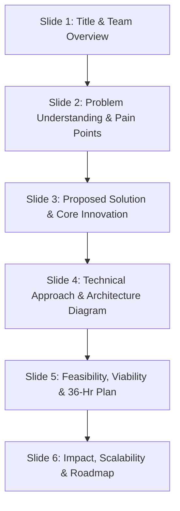

# 🏆 Smart India Hackathon (SIH 2026) — Master Intel, Official Rules & Grand Finale Playbook
### Team Guide for Problem Statement SIH26056 (MoSPI) | Project: Operation APIx

---

## 📅 Section 1: Official Timeline & Key Milestones

The Smart India Hackathon follows a strict national calendar managed by the **Ministry of Education's Innovation Cell (MIC)** and **AICTE**:

| Phase | Milestone / Window | Key Action Items & Ownership |
| :--- | :--- | :--- |
| **Phase 1 (Current)** | **September 2026** | **College Internal Hackathon & Team Nomination**<br>• Colleges conduct an internal hackathon with an external jury.<br>• Your college **Single Point of Contact (SPOC)** selects the top 45 teams (plus 5 waitlisted) and uploads team data to `sih.gov.in`. |
| **Phase 2** | **Late Sep / Early Oct 2026** | **National Idea Submission Deadline**<br>• SPOC uploads the official **6-slide Idea PPT (PDF format, under 10MB)** along with the executive project summary. |
| **Phase 3** | **October – November 2026** | **Central Pre-Screening & Evaluation**<br>• Ministry (MoSPI) domain experts and AICTE evaluators conduct blind scoring of submitted PPTs. |
| **Phase 4** | **Late November 2026** | **Grand Finale Finalists Announced**<br>• Top **4 to 6 teams per problem statement** are shortlisted nationally.<br>• Assigned Nodal Centers across India are published. |
| **Phase 5** | **December 2026** | **36-Hour Physical Grand Finale**<br>• 36-hour non-stop in-person hackathon held at an assigned premier institute (IIT/NIT/Central University). |

---

## 👥 Section 2: Non-Negotiable Team Rules & Constraints

> [!CAUTION]
> ### 🚨 Fatal Rule #1: Mandatory 1 Female Member Clause
> Every SIH team must consist of **strictly 6 student members** from the same institution, and **at least ONE female member is strictly mandatory**.
> - Submitting an all-male team results in **automatic disqualification** by the portal or your SPOC.
> - Ensure at least one (or both) of your two open recruitment slots is assigned to a female classmate.

### 2. Single Institution Mandate
* All 6 members must belong to the **exact same college or institute**. Inter-college teams are strictly forbidden.

### 3. Identity Anonymity
* Your team name must **never contain the name of your college, city, or institute** (e.g. naming a team `"IIT_Delhi_Coders"` will disqualify you to preserve blind evaluation integrity).

### 4. Mentors
* You may register up to **2 official mentors** (1 academic faculty member + 1 external industry professional with $\ge 5$ years domain experience). Mentors can advise at the Nodal Center but cannot code during judging.

---

## 📑 Section 3: Official 6-Slide Idea Submission PPT Blueprint

Evaluators review hundreds of submissions. Your deck must strictly adhere to the official 6-slide structure:



| Slide # | Slide Title | Key Content for Operation APIx (SIH26056) | Evaluator Weight |
| :--- | :--- | :--- | :---: |
| **Slide 1** | **Title Page** | • Problem Statement: `SIH26056` (MoSPI)<br>• Category: Software | Theme: Miscellaneous / FinTech<br>• Team Name & Leader Details<br>• Institute Name & SPOC Name | Format Compliance |
| **Slide 2** | **Problem Understanding** | • Explain how physical surveyors visiting airline counters once a month miss 90%+ dynamic surges on OTAs.<br>• MoSPI mandate: CPI Base Revision (2024=100) requires digital, high-frequency price collection. | Problem Depth (20%) |
| **Slide 3** | **Proposed Solution** | • **Operation APIx**: Automated multi-source ingestion engine + Laspeyres price index formula.<br>• Unbundling base fares from GST, UDF, PSF fees.<br>• Advance booking horizons ($T+1, T+7, T+15, T+30, T+45$). | Innovation (25%) |
| **Slide 4** | **Technical Approach** | • Multi-tier architecture: Playwright stealth scraper + OTA internal JSON APIs.<br>• Fast FastAPI / Express backend + PostgreSQL database.<br>• Interactive React Command Center with live India route heatmaps + RBI API. | Technical Soundness (25%) |
| **Slide 5** | **Feasibility & Viability** | • Anti-bot evasion strategy (human emulation, rotating user agents, header replication).<br>• 36-hour execution plan: offline mock databases + live 1-route query sandbox.<br>• Risk mitigation for OTA schema drift. | Feasibility (20%) |
| **Slide 6** | **Impact & Scalability** | • Empowers the Reserve Bank of India (RBI) Monetary Policy Committee to target 4% inflation accurately.<br>• Eliminates human surveyor error across all 28 states.<br>• Post-hackathon scaling: extend to railway dynamic surge pricing. | Impact & Benefits (10%) |

---

## ⏱️ Section 4: 36-Hour Grand Finale Survival Mechanics

During the physical hackathon, evaluation occurs across **two Mentoring Rounds** and **three Evaluation Rounds**:

```mermaid
journey
    title 36-Hour SIH Grand Finale Operational Rhythm
    section Day 1: Foundation & Steering
      Check-in & Desk Setup : 07:30 : Team
      Coding Kickoff : 09:00 : All
      Mentoring Round 1 (Course Correction) : 11:30 : Mentors
      Sprint 1 (DB, API & Scraper Core) : 14:00 : Team
      Evaluation Round 1 (Foundation Check) : 19:30 : Judges
    section Night 1: Integration & Stress
      Midnight Snack & Coffee : 00:00 : Organizers
      Mentoring Round 2 (Blocker Resolution) : 01:30 : Mentors
      All-Night Sprint 2 (Index Math & UI Polish) : 03:00 : Team
    section Day 2: Polish, Demo & Verdict
      Evaluation Round 2 (Working Prototype Check) : 08:30 : Judges
      Sprint 3 (Offline Docker Freeze & Pitch Polish) : 10:30 : Team
      Final Power Round (The Stage Pitch & Live Q&A) : 14:00 : Full Jury
      Valedictory & Prize Ceremony : 18:30 : VIPs
```

### The 5 Crucial Evaluation Rounds Explained:

1. **Mentoring Round 1 (Day 1, ~11:30 AM)**:
   * Industry and MoSPI mentors visit your table to critique your plan.
   * *Golden Rule:* Never argue with mentors. Write down every single suggestion on a visible whiteboard.
2. **Evaluation Round 1 (Day 1, ~07:30 PM)**:
   * Judges inspect running databases, configured API endpoints, and clean Git commits.
   * *Secret Test:* Judges explicitly ask: *"What did mentors ask you to change at 11:30 AM, and how did you implement it?"*
3. **Mentoring Round 2 (Night 1, ~01:30 AM)**:
   * Night mentors check code-level progress and API integrations. Have your core index engine running in terminal/Postman even if the UI is still unpolished.
4. **Evaluation Round 2 (Day 2, ~08:30 AM)**:
   * Judges verify end-to-end data flow: Scraper $\rightarrow$ Cleaning $\rightarrow$ Index Computation $\rightarrow$ Dashboard.
5. **Final Power Round (Day 2, ~02:00 PM)**:
   * Formal stage pitch: **5 minutes live working demo + 3 minutes rapid-fire Q&A** before senior ministry officials.

---

## 🏛️ Section 5: Logistics, Financials & Intellectual Property

* **Prize Money**: **₹1,00,000 (₹1 Lakh)** awarded to the 1st place winning team per problem statement.
* **Travel Allowance (TA)**: All 6 student team members receive **to-and-fro 2nd Class Sleeper (Non-AC) railway fare reimbursement** directly at the Nodal Center upon presenting confirmed train tickets.
* **Food & Accommodation**: **100% complimentary** at host institute hostels with continuous meals, snacks, and midnight coffee.
* **Intellectual Property (IP)**: Governed by a **50:50 shared IP framework** between the team and MoSPI, with MoSPI having first right of refusal to adopt, fund, or incubate the solution into a live government deployment.

---

## ⚠️ Section 6: Top 5 Fatal Elimination Traps to Avoid

1. **The College Branding Trap**: Wearing college hoodies or putting your college logo on PPT slides is grounds for instant disqualification.
2. **The "Wifi Deadzone" Disaster**: Nodal center Wi-Fi routinely chokes when 300 developers connect. **Always have a local offline fallback** (Dockerized PostgreSQL with 30 days of pre-cached domestic flight prices) so your demo never freezes.
3. **Buzzword Overload**: Claiming you used "Quantum Neural Networks" when a standard Laspeyres index formula was needed. Ministry statisticians will immediately grill you on mathematical rigor.
4. **Figma-Only Demos**: Presenting static mockups or non-reactive UI in Evaluation Round 2. Judges will reject non-functional prototypes.
5. **Ignoring Mentor Feedback**: Failing to implement the changes requested during Mentoring Round 1. Showing tangible agility is 15% of your final score!
