# 🛠️ Operation APIx: Master Tech Stack & Library Modules Specification
### Project: Real-Time Airfare Price Index for India (MoSPI - SIH26056)
**Target Stakeholders**: Ministry of Statistics and Programme Implementation (MoSPI / NSO), Reserve Bank of India (RBI), DGCA  
**Document Status**: Official Architecture Specification | **Date**: September 2026

---

## 📌 Executive Summary

Operation APIx requires an enterprise-grade, high-frequency, resilient architecture capable of:
1. Harvesting dynamic airfare quotes across **11 mandated portals** (5 direct carriers + 6 OTAs).
2. Normalizing prices across **15 aviation edge cases** (unbundling taxes, stripping drip fees, harmonizing baggage, IQR outlier bounding).
3. Compiling an official **DGCA passenger-weighted Laspeyres Price Index** across 12 domestic corridors and 5 booking horizons ($T+1$ to $T+45$).
4. Serving real-time data to MoSPI and RBI economists through a **FastAPI REST gateway** and a **React Executive Command Center**.

To accomplish this with maximum speed, zero-downtime reliability during hackathon evaluations, and statistical rigor, the system uses a carefully selected, decoupled tech stack.

---

## 🧱 1. Complete Technology Stack Matrix

| Architecture Layer | Core Technology / Framework | Primary Libraries / Modules | Key Role & Justification |
| :--- | :--- | :--- | :--- |
| **Stage 1: API Sniffer** | Python 3.11+ / Async I/O | `curl-cffi`, `httpx` | Sub-second (<800ms) direct JSON endpoint extraction with Chrome 124 TLS/JA3 fingerprint impersonation. Bypasses WAF without browser overhead. |
| **Stage 2: Stealth Browser** | Headless Chromium Automation | `playwright`, `playwright-stealth` | Client-side DOM hydration for complex SPA portals (MakeMyTrip, IndiGo), `_abck` cookie harvesting, and humanized cursor jitter. |
| **Data Contract & Validation**| Schema Integrity Engine | `pydantic` (v2.7+), `hashlib` | Enforces IATA airport codes, positive fare rules, and produces deterministic SHA-256 deduplication hashes. |
| **Normalization & Analytics** | Scientific Data Processing | `pandas`, `numpy`, `scipy`, `zoneinfo` | 15 edge case filters: IQR price bounding, hedonic missing-fare imputation, UTC to `Asia/Kolkata` time alignment. |
| **Math & Index Engine** | Econometric Statistical Engine| `numpy`, Custom Laspeyres Module | Implements official Laspeyres formula weighted by DGCA passenger traffic volume across 12 corridors. |
| **Dual-Tier Persistence** | Relational Database Layer | `SQLAlchemy` (v2.0+), `sqlite3`, `psycopg2-binary` | Dialect-agnostic schema: Local SQLite WAL for zero-latency offline demo + Supabase PostgreSQL for cloud production. |
| **Fault-Tolerance & Cache** | Resilience & Demo Guarantee | Custom Circuit Breaker, JSON Replay Cache | Isolates failing portals (trip at 3 fails / 1800s cooldown) and serves cached flight snapshots if portals go down. |
| **Backend REST Gateway** | Asynchronous Micro-Framework | `fastapi`, `uvicorn`, `pydantic` | High-throughput sub-50ms REST API providing OpenAPI / Swagger docs, JSON endpoints, and CSV feeds for RBI/MoSPI. |
| **Frontend Command Center** | Modern Reactive SPA | `React 18`, `Vite`, `Tailwind CSS`, `Lucide React` | Executive dashboard featuring live DGCA route heatmaps, $T+1$ to $T+45$ yield curves, and inflation alerts. |
| **Testing & Quality Sentinel** | Verification & Drift Guardian | `pytest`, `pipeline.sentinel` | Continuous auditing of 12/12 route coverage, 5/5 horizon completeness, and schema integrity gates. |

---

## 📦 2. Deep Module Breakdown & Library Justifications

### 🌐 Layer 1: Two-Stage Harvester Engine (Scraping & Anti-Bot)

```
scrapers/
├── base_scraper.py         # Abstract Base Adapter (Session lifecycle, retry, rate limit)
├── browser_engine.py       # Playwright Stealth Browser Context Manager
├── airlines/
│   ├── indigo_scraper.py   # Navitaire DotRez / Akamai bypass
│   ├── airindia_scraper.py # Amadeus Altéa / NDC XML-JSON
│   ├── airindia_express.py # Navitaire / Cloudflare
│   ├── akasa_scraper.py    # Direct REST API
│   └── spicejet_scraper.py # Navitaire DotRez Session
└── otas/
    ├── easemytrip_scraper.py # High-speed XHR JSON extraction
    ├── ixigo_scraper.py      # REST API / Turnstile handler
    ├── makemytrip_scraper.py # Headless Playwright / Hydrated DOM
    ├── yatra_scraper.py      # JSON XHR / CSRF Handshake
    ├── cleartrip_scraper.py  # REST API / Paise normalizer
    └── goibibo_scraper.py    # MMT Platform Adapter
```

#### Libraries Used:
1. **`curl-cffi` (>= 0.7.0)**:
   * **Why**: Modern airlines and OTAs (Akamai Bot Manager, Cloudflare) inspect the client's TLS fingerprint (JA3/JA4) and HTTP/2 SETTINGS frames. Standard Python `requests` or `urllib` get immediately blocked with HTTP 403. `curl-cffi` directly impersonates Chrome 124's exact cryptographic handshake at the socket layer.
   * **Application**: Used in Stage 1 API Sniffing for EaseMyTrip, Ixigo, Yatra, and Akasa Air to extract quotes in under 800ms with zero RAM overhead.
2. **`playwright` (>= 1.46.0)**:
   * **Why**: Heavyweight single-page applications (MakeMyTrip, IndiGo) dynamically assemble pricing DOM structures and require genuine JavaScript execution. Playwright provides native async execution and precise CDP (Chrome DevTools Protocol) event interception.
   * **Application**: Used in Stage 2 Stealth Scraping to simulate human interactions, handle cookie handshakes, and intercept background XHR responses.
3. **`selectolax` (>= 0.3.21) & `beautifulsoup4` (>= 4.12.0)**:
   * **Why**: When extracting JSON payloads embedded in SSR scripts (`<script id="__NEXT_DATA__">`), `selectolax` (written in C) parses HTML up to 25x faster than standard parsers.

---

### 🛡️ Layer 2: Schema Contracts & Quality Sentinel

```
pipeline/
├── models.py      # Pydantic v2 schemas (RawFlightQuote, CleanedFlightQuote)
├── sentinel.py    # Quality gate, route completeness watchdog & drift monitor
└── normalizer.py  # 15 Edge case normalization rules & tariff unbundler
```

#### Libraries Used:
1. **`pydantic` (>= 2.7.0)**:
   * **Why**: Pydantic v2 core is compiled in Rust, offering 5–10x faster serialization and validation.
   * **Application**:
     * `FareBreakdown`: Ensures total fare matches component sum and rejects negative prices.
     * `RawFlightQuote`: Validates 3-letter IATA airport codes, enforces uppercase formatting, and validates the 5 mandated booking windows (`T+1`, `T+7`, `T+15`, `T+30`, `T+45`).
     * Deterministic Deduplication: `dedup_hash` generated via SHA-256 across `[portal, carrier, flight_number, origin, dest, departure, window, date]`.
2. **`hashlib` (Standard Library)**:
   * **Why**: Instant, zero-overhead computation of unique cryptographic quote fingerprints for database deduplication.

---

### 🔬 Layer 3: Tariff Auditing & 15 Edge-Case Normalization Pipeline

#### Libraries Used:
1. **`pandas` (>= 2.2.0)**:
   * **Why**: Vectorized transformations, time-series indexing, and grouping.
   * **Application**: Grouping quotes by route and booking window, joining baseline period prices, and calculating rolling averages.
2. **`numpy` (>= 1.26.0) & `scipy` (>= 1.13.0)**:
   * **Why**: Robust statistics and distribution bounds.
   * **Application**:
     * **IQR Outlier Bounding (EC-7)**: Calculates $Q_1, Q_3$ and $\text{IQR} = Q_3 - Q_1$, clamping valid quotes within $[\max(1500, Q_1 - 1.5 \cdot \text{IQR}), \min(35000, Q_3 + 2.5 \cdot \text{IQR})]$ to strip erroneous ₹0 glitch fares and business class leaks.
     * **Hedonic Regression & Imputation (EC-5)**: Imputes missing prices for sold-out flights on $T+1$ emergency windows to prevent survivorship deflation bias.
3. **`zoneinfo` (Standard Library)**:
   * **Why**: Replaces deprecated `pytz` with Python 3.9+ native IANA timezone database.
   * **Application (EC-10)**: Normalizes midnight flights (e.g. 00:35 IST) departing from UTC servers, ensuring they are mapped to the correct Indian Standard Time date.

---

### 📈 Layer 4: Mathematical Econometric Index Engine

```
engine/
└── laspeyres.py    # Official Laspeyres Price Index & MoM Inflation Calculator
```

#### Mathematical Formulation:
$$\text{APIx}_t = \sum_{i=1}^{M} W_i \left( \frac{P_{i,t}}{P_{i,0}} \right) \times 100$$
Where:
* $M = 12$: Representative DGCA domestic corridors.
* $W_i$: Normalized passenger traffic weight derived from DGCA monthly reports ($\sum W_i = 1.000$).
* $P_{i,t}$: Median pure economic fare ($\text{Base Fare} + \text{Fuel Surcharge YQ}$) for corridor $i$ on day $t$.
* $P_{i,0}$: Baseline period fare (Base Year 2024 = 100).

---

### 💾 Layer 5: Dual-Tier Persistence & Fail-Safe Storage

```
database/
├── apix.db              # High-performance SQLite 3 database (WAL mode)
├── schema.sql           # Dialect-agnostic DDL schema (SQLite + Postgres)
├── db.py                # Database connection factory & session provider
├── seed_mock_data.py    # 30-day realistic historical generator (5,580 quotes)
└── cache/               # Fail-safe JSON snapshots for 100% demo uptime
```

#### Libraries Used:
1. **`sqlalchemy` (>= 2.0.30)**:
   * **Why**: Unified database abstraction supporting modern `session.execute(text(...))` syntax and connection pooling.
   * **Application**: Allows single-line configuration switching via `DATABASE_URL` between local SQLite for instant zero-dependency testing and Supabase PostgreSQL for cloud deployment.
2. **`psycopg2-binary` (>= 2.9.9)**:
   * **Why**: Standard C-optimized PostgreSQL client library for cloud database connections.
3. **`state/circuit_breakers.json`**:
   * **Why**: File-backed persistent state machine tracking consecutive portal scraping failures. If any portal returns 3 errors (HTTP 403, 429, timeout), it trips to `OPEN` for 1800s cooldown, triggering the fail-safe cache fallback to protect live demonstrations.

---

### 🚀 Layer 6: Backend API Gateway

```
backend/
├── main.py          # FastAPI application factory & middleware setup
└── routes/
    ├── apix.py      # Core index endpoints (Summary, Time-series, Corridor analysis)
    ├── routes.py    # City-pair metadata & DGCA weight registry
    └── health.py    # System health, sentinel audit, & circuit breaker status
```

#### Libraries Used:
1. **`fastapi` (>= 0.111.0)**:
   * **Why**: Asynchronous, highly performant, auto-generates OpenAPI (Swagger) specifications required by MoSPI and RBI technical reviewers.
2. **`uvicorn` (>= 0.30.0)**:
   * **Why**: Lightning-fast ASGI web server implementation based on `uvloop` and `httptools`.
3. **Primary Endpoints**:
   * `GET /api/v1/apix/summary`: Headline national APIx, 24h change, MoM inflation rate.
   * `GET /api/v1/apix/timeseries`: Daily, weekly rolling, and monthly historical index points.
   * `GET /api/v1/apix/routes`: Route-by-route breakdowns, average pure fares, and quote counts.
   * `GET /api/v1/apix/elasticity`: Price dispersion curve from $T+1$ to $T+45$ booking horizons.
   * `GET /api/v1/apix/audit`: Real-time Sentinel data health and coverage checks.
   * `GET /api/v1/apix/export.csv`: Direct CSV export for NSO econometric modeling.

---

### 🖥️ Layer 7: MoSPI Executive Command Center (Frontend)

```
frontend/ (React + Vite)
├── src/
│   ├── components/
│   │   ├── MetricCards.jsx      # National APIx, MoM Inflation, Active Scrapers
│   │   ├── RouteHeatmap.jsx     # 12 Corridor traffic & price surge visualizer
│   │   ├── ElasticityCurve.jsx  # T+1 vs T+45 lead-time price curve
│   │   ├── PortalHealth.jsx     # Real-time status of all 11 scraping adapters
│   │   └── IndiaAirMap.jsx      # Interactive SVG/Leaflet domestic air corridor map
│   ├── services/
│   │   └── api.js               # Axios / Fetch client connecting to FastAPI backend
│   └── App.jsx                  # Main dashboard layout with dark/light MoSPI theme
```

#### Libraries & Tools:
1. **`React 18` + `Vite`**: Instant bundling, fast HMR, component modularity.
2. **`Tailwind CSS`**: Rapid UI styling adhering to professional government analytics design guidelines.
3. **`Lucide React`**: Clean, accessible iconography.
4. **`Recharts` / `Chart.js`**: Interactive time-series charts, dual-axis CPI vs APIx comparisons, and dynamic yield curves.
5. **`Leaflet` / `react-simple-maps`**: Geographic visual rendering of domestic air corridors with color-coded surge indicators.

---

### 🧪 Layer 8: Testing, Benchmarking & Master CLI

```
tests/
├── test_models.py      # Pydantic schema validation & hash consistency tests
├── test_normalizer.py  # 15 edge case unit tests (tax stripping, baggage harmonization)
├── test_laspeyres.py   # Mathematical verification against sample manual calculations
└── test_sentinel.py    # Quality gate and coverage verification
benchmarks/
└── backtester.py       # 30-Day verification against official DGCA/MoSPI reports
manage.py               # Master Command-Line Interface
```

#### Libraries Used:
1. **`pytest` (>= 8.2.0)**: Test runner for automated test suites.
2. **`argparse` (Standard Library)**: Unified developer CLI (`manage.py`) for initializing databases, seeding test data, calculating indices, and launching services.

---

## 📋 3. `requirements.txt` Quick Reference

```ini
# Core HTTP & Network (Stage 1 Ingestion)
httpx>=0.27.0
curl-cffi>=0.7.0
requests>=2.31.0
python-dotenv>=1.0.0

# Browser Automation & Anti-Bot (Stage 2 Ingestion)
playwright>=1.46.0

# Data Validation, Parsing & Cleaning
pydantic>=2.7.0
pandas>=2.2.0
numpy>=1.26.0
scipy>=1.13.0
beautifulsoup4>=4.12.0
selectolax>=0.3.21

# Database & Storage (SQLite / Supabase Postgres)
sqlalchemy>=2.0.30
psycopg2-binary>=2.9.9

# Backend REST API
fastapi>=0.111.0
uvicorn>=0.30.0

# Testing & Quality Assurance
pytest>=8.2.0
```

---

## 🎯 4. Architectural Cohesion & Data Flow Summary

```mermaid
flowchart LR
    subgraph INGESTION["1. Two-Stage Ingestion"]
        A["curl-cffi (XHR APIs)"]
        B["Playwright (Stealth DOM)"]
    end

    subgraph VALIDATION["2. Data Gate & Audit"]
        C["Pydantic v2 Models"]
        D["15 Edge Case Normalizer"]
        E["Data Sentinel Watchdog"]
    end

    subgraph ENGINE["3. Mathematical Engine"]
        F["DGCA Laspeyres Engine"]
        G["Multi-Horizon Aggregator"]
    end

    subgraph PERSISTENCE["4. Dual-Tier Storage"]
        H[("SQLite WAL (Local)")]
        I[("Supabase (Postgres)")]
        J[("Fail-Safe Cache (JSON)")]
    end

    subgraph SERVING["5. Delivery Layer"]
        K["FastAPI REST Endpoints"]
        L["React / Vite Dashboard"]
        M["NSO / RBI Direct Feeds"]
    end

    INGESTION --> VALIDATION --> ENGINE --> PERSISTENCE --> SERVING
```



This modular stack ensures **low latency, absolute compliance with MoSPI's statistical mandates, automated handling of hostile anti-bot protections, and 100% fail-safe demo reliability**.
