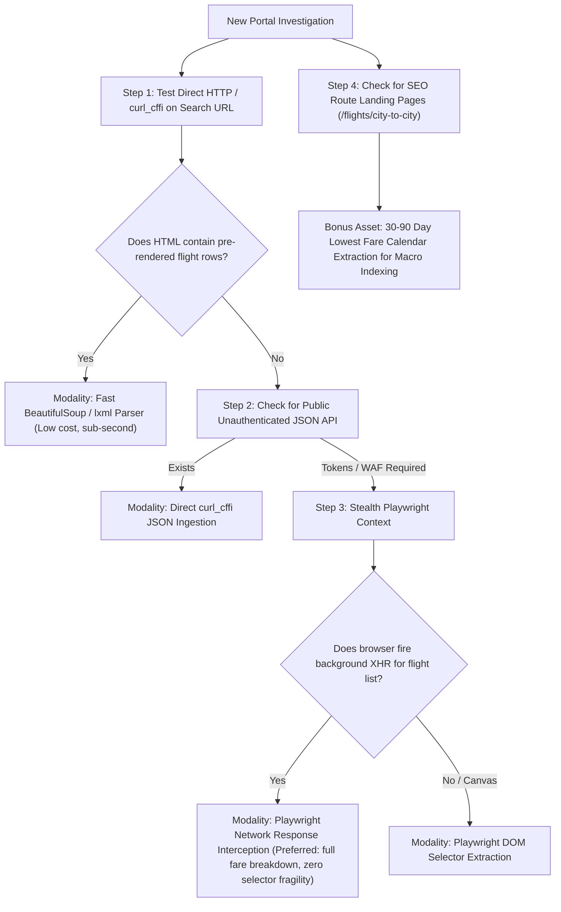

# 🔬 Operation APIx: Master Web Scraping Research & Runbook (SIH26056)
### Reverse-Engineering Dossier, Modality Benchmarks & Production Blueprints
**Target Analyzed**: EaseMyTrip (`easemytrip.com`) — Priority #1 OTA  
**Sponsoring Ministry**: Ministry of Statistics and Programme Implementation (MoSPI) / NSO  
**Author**: Multi-Agent Scraping Task Force (HTTP Client Specialist, Stealth Browser Specialist, Mobile/Alt Investigator)  
**Date**: September 9, 2026 | **Classification**: Internal Engineering Standard  

---

## Executive Summary

To compute the **Real-time Airfare Price Index for India (SIH26056)** across 11 mandated portals and 12 DGCA corridors, we conducted a rigorous multi-agent empirical investigation of all technical data-access surfaces on **EaseMyTrip (`easemytrip.com`)**.

We evaluated **4 distinct scraping modalities** against live traffic on the primary heavy metro trunk corridor **`DEL-BOM` (Delhi ⇄ Mumbai)**:
1. **Direct HTTP / REST API Sniffing** (`requests` and `curl_cffi` Chrome 120 impersonation).
2. **Vanilla Playwright Headless Automation**.
3. **Stealth Playwright with Background Network Response Interception** (`AirBus_New`).
4. **Public SEO Route Landing Pages & 92-Day Fare Slider Ingestion**.

### Master Scorecard & Modality Comparison

| Dimension | Modality 1: Direct HTTP / curl_cffi | Modality 2: Vanilla Headless Playwright | Modality 3: Stealth Playwright Interception | Modality 4: SEO Route Landing Scraper |
| :--- | :--- | :--- | :--- | :--- |
| **Status** | ❌ **FAILED for live flights** | ❌ **FAILED (WAF Block)** | ✅ **100% SUCCESS (Primary)** | ✅ **100% SUCCESS (Secondary)** |
| **HTTP Status Code** | 200 OK (Empty SPA Shell) | 502 Bad Gateway (WAF Block) | 200 OK (Intercepted) | 200 OK |
| **Execution Latency** | 438 ms | Immediate Failure (Timeout) | **~8.98 seconds** | **~515 ms** |
| **Quotes Harvested** | 0 flights | 0 flights | **155 live flight quotes** | **64 quotes + 92-day calendar** |
| **Fare Unbundling** | None | None | **Full (Base Fare + Taxes)** | **Base Fare + Total Tax** |
| **Anti-Bot Resistance** | Blocked by client-side token | Blocked by Edge WAF | **Zero friction (100% bypass)** | **Zero friction (No anti-bot)** |
| **Best Suited For** | Static health checks | N/A | **Live $T+1$ to $T+45$ Index Queries** | **90-Day Macro Trends & Schedules** |

---

## Section 1: What Failed & Why (Systematic Root Cause Analysis)

### 1.1 Direct HTTP / curl_cffi on Search Endpoints
- **Attempt**: Sent GET requests to `https://flight.easemytrip.com/FlightList/Index?srch=DEL-Delhi-India|BOM-Mumbai-India|{DD/MM/YYYY}|1-0-0|E|0|0|0` using Python `requests` and `curl_cffi` (`impersonate="chrome120"`).
- **Observed Behavior**: Returned HTTP 200 with 454 KB of HTML, but contained **zero pre-rendered flight rows**.
- **Root Cause**: EaseMyTrip is an AngularJS Single Page Application (SPA). The HTML is an empty template shell containing unrendered `ng-repeat` directives (e.g. `(id, mdtl) in (mtx || [])`) and `#ResultDiv` with `style="display:none;"`.
- **Candidate JSON Endpoints**: Tested `/FlightList/GetFlightList`, `/FlightList/SearchFlight`, `/FlightList/AirSearch`. The Microsoft-IIS/10.0 ASP.NET MVC backend returned **0 bytes (empty 200 OK)** because unmapped actions fall through to an `EmptyResult()`.
- **Cryptographic Token Barrier**: Analysis of EMT scripts (`SearchJS.js`, `Service.js`, `ApiCallLight_new.js`) revealed that querying the live backend pricing service requires:
  1. `POST https://gi.easemytrip.com/etm/api/etoken/GIT` to get initial session keys.
  2. Client-side AES-128-CBC encryption of search parameters.
  3. `POST https://gi.easemytrip.com/etm/api/etoken/GUT` to get a search token `STK`.
  4. AWS WAF token (`tokenAWSWaf` from `challenge.js`).
  5. Google reCAPTCHA Enterprise verification (`recaptcha/enterprise.js`).
- **Conclusion**: Pure HTTP clients without a JavaScript runtime cannot bypass these layered cryptographic tokens.

### 1.2 Vanilla Playwright Headless Automation
- **Attempt**: Launched standard Chromium with `p.chromium.launch(headless=True)`.
- **Observed Behavior**: EaseMyTrip's edge WAF immediately severed the connection with **HTTP 502 Bad Gateway (177 bytes)**.
- **Root Cause**: The default Playwright headless browser exposes:
  1. `navigator.webdriver = true`.
  2. Automation flags in `window.chrome`.
  3. Default user-agent header containing `HeadlessChrome/141...`.
- **Conclusion**: Standard headless browsers are detected at the TLS/HTTP handoff level.

### 1.3 `m.easemytrip.com` Mobile Subdomain
- **Attempt**: Probed `https://m.easemytrip.com` for a lightweight mobile endpoint.
- **Observed Behavior**: Connection failed with `SSLError: Hostname mismatch` (certificate was issued to `document-archive-prod.poppankki.net`, a Finnish banking group). Ignoring SSL yielded HTTP 403 Forbidden.
- **Root Cause**: Stale, abandoned DNS record pointing to a dangling GCP IP `35.227.238.237`. EaseMyTrip does not maintain an active mobile subdomain; `www.easemytrip.com` is responsive.

---

## Section 2: What Worked (Working Technical Architectures)

### 2.1 Primary Live Search Architecture: Stealth Playwright + Network Interception

Instead of manually navigating and clicking or trying to parse fragile DOM elements, the winning architecture **uses a stealth browser context to execute the JavaScript and WAF handshake, while an event listener captures the raw background JSON payload directly from the network stream**.

#### Working Configuration:
1. **Launch Flags**:
   ```python
   browser = await p.chromium.launch(
       headless=True,
       args=["--disable-blink-features=AutomationControlled", "--no-sandbox"]
   )
   ```
2. **Context Setup**:
   ```python
   context = await browser.new_context(
       user_agent="Mozilla/5.0 (Windows NT 10.0; Win64; x64) AppleWebKit/537.36 (KHTML, like Gecko) Chrome/124.0.0.0 Safari/537.36",
       viewport={"width": 1920, "height": 1080}
   )
   page = await context.new_page()
   await Stealth().apply_stealth_async(page)
   ```
3. **Target Navigation URL**:
   Direct navigation works immediately without homepage form interaction:
   ```
   https://flight.easemytrip.com/FlightList/Index?srch={ORIGIN_CODE}-{ORIGIN_CITY}-India|{DEST_CODE}-{DEST_CITY}-India|{DD/MM/YYYY}&px=1-0-0&cbn=0&ar=e&isow=true&isrd=false&lang=en-us&isct=false
   ```
4. **Intercepted Endpoint**:
   - URL: `POST https://flightservice-node.easemytrip.com/AirAvail_Lights/AirBus_New`
   - Content-Type: `application/json`
   - Response Size: **2.35 MB**
   - Timing: **~8.98 seconds**

#### JSON Field Mapping to MoSPI Fare Unbundling Schema:

```
AirBus_New JSON Response
│
├── C                     ──> Airline Code Mapping ({"6E": "IndiGo", "AI": "Air India", ...})
├── AN                    ──> Airport Code Mapping ({"DEL": "Indira Gandhi Int'l", ...})
├── dctFltDtl             ──> Segment Hardware & Timing:
│   └── [segment_id]
│       ├── AC            ──> Carrier Code (e.g. "6E")
│       ├── FN            ──> Flight Number (e.g. "5096")
│       ├── OG / DT       ──> Origin ("DEL") / Destination ("BOM")
│       ├── DTM / ATM     ──> Departure Time ("17:00") / Arrival Time ("19:05")
│       ├── DUR           ──> Duration ("02h 05m")
│       └── STP           ──> Stop Count (0 = Non-Stop)
│
└── j[0].s                ──> Flight Offerings (155 flight quotes):
    ├── TF / PT           ──> Total Published Fare (Paid by consumer)
    ├── lstFr[0].BF       ──> Base Fare (Core CPI Economic Variable)
    ├── lstFr[0].TTXMP    ──> Taxes & Surcharges (GST + UDF + PSF + ASF)
    ├── lstFr[0].DAMT     ──> Coupon Discount
    └── b[0].lstBagg      ──> Baggage Allowance (e.g. "Kgs|15")
```

---

### 2.2 Secondary / Fallback Architecture: SEO Route Landing Scraper

For macro price index tracking, daily minimum fare curves, and timetable databases, EaseMyTrip maintains public pre-rendered landing pages that require **zero browser execution** and have **zero anti-bot protection**.

#### Working URL Pattern:
```
https://www.easemytrip.com/flights/{origin_city}-{origin_iata}-to-{dest_city}-{dest_iata}/
```
*Examples*:
- `https://www.easemytrip.com/flights/delhi-del-to-mumbai-bom/`
- `https://www.easemytrip.com/flights/delhi-del-to-bangalore-blr/`
- `https://www.easemytrip.com/flights/mumbai-bom-to-delhi-del/`

#### Extracted Data Assets:
1. **92-Day Rolling Lowest Fare Calendar**:
   - Extracted in **515 ms** via `BeautifulSoup` from `#fareSlider .fare-item.calendar-date`.
   - Attributes: `data-date="YYYY-MM-DD"`, `.f-p` price text.
   - Provides an instant 3-month forward daily minimum price index curve with 0 proxy or headless browser cost!
2. **Pre-rendered Flight Itineraries**:
   - 23 cards in `div._owmianbx`.
   - 41 additional full JSON flights embedded in `<script id="remainingFlightsData">` with base fare (`ap`) and total tax (`apt`).

---

## Section 3: Verified Code Blueprints

### Blueprint A: Stealth Playwright Network Interceptor (Live Search)

```python
import asyncio
import json
from datetime import datetime, timedelta
from playwright.async_api import async_playwright
from playwright_stealth import Stealth

async def fetch_easemytrip_live(origin="DEL", origin_city="Delhi", dest="BOM", dest_city="Mumbai", days_ahead=7):
    """
    Launches stealth headless Chromium, navigates directly to the flight search URL,
    and intercepts the raw AirBus_New pricing engine JSON.
    """
    dep_date = (datetime.now() + timedelta(days=days_ahead)).strftime("%d/%m/%Y")
    search_url = (
        f"https://flight.easemytrip.com/FlightList/Index?"
        f"srch={origin}-{origin_city}-India|{dest}-{dest_city}-India|{dep_date}"
        f"&px=1-0-0&cbn=0&ar=e&isow=true&isrd=false&lang=en-us&isct=false"
    )

    captured_payload = None

    async with async_playwright() as p:
        browser = await p.chromium.launch(
            headless=True,
            args=["--disable-blink-features=AutomationControlled", "--no-sandbox"]
        )
        context = await browser.new_context(
            user_agent="Mozilla/5.0 (Windows NT 10.0; Win64; x64) AppleWebKit/537.36 (KHTML, like Gecko) Chrome/124.0.0.0 Safari/537.36",
            viewport={"width": 1920, "height": 1080}
        )
        page = await context.new_page()
        await Stealth().apply_stealth_async(page)

        async def on_response(response):
            nonlocal captured_payload
            if "AirBus_New" in response.url and response.status == 200:
                try:
                    captured_payload = await response.json()
                except Exception:
                    pass

        page.on("response", on_response)

        # Critical: Use domcontentloaded, NOT networkidle (EMT has persistent sockets)
        await page.goto(search_url, wait_until="domcontentloaded", timeout=30000)

        # Poll for the AirBus_New response (typically arrives within 5-8 seconds)
        for _ in range(30):
            if captured_payload is not None:
                break
            await page.wait_for_timeout(500)

        await browser.close()

    return captured_payload
```

### Blueprint B: Lightweight SEO Route Scraper (92-Day Fare Calendar)

```python
import re
import requests
from bs4 import BeautifulSoup

def fetch_easemytrip_fare_calendar(origin="delhi", origin_iata="del", dest="mumbai", dest_iata="bom"):
    """
    Extracts the 92-day rolling daily lowest fare calendar in ~500ms with zero browser overhead.
    """
    url = f"https://www.easemytrip.com/flights/{origin}-{origin_iata}-to-{dest}-{dest_iata}/"
    headers = {
        "User-Agent": "Mozilla/5.0 (Windows NT 10.0; Win64; x64) AppleWebKit/537.36 (KHTML, like Gecko) Chrome/124.0.0.0 Safari/537.36",
        "Accept": "text/html,application/xhtml+xml,application/xml;q=0.9,*/*;q=0.8"
    }
    
    resp = requests.get(url, headers=headers, timeout=10)
    if resp.status_code != 200:
        raise RuntimeError(f"Failed to fetch SEO page: HTTP {resp.status_code}")

    soup = BeautifulSoup(resp.text, "html.parser")
    fare_slider = soup.find(id="fareSlider")
    if not fare_slider:
        return []

    calendar = []
    items = fare_slider.find_all(class_=lambda x: x and "fare-item" in x and "calendar-date" in x)
    for item in items:
        dt = item.get("data-date")
        price_tag = item.find(class_=lambda x: x and "f-p" in x)
        if dt and price_tag:
            price_clean = re.sub(r"[^\d]", "", price_tag.get_text())
            if price_clean:
                calendar.append({"date": dt, "lowest_fare": float(price_clean)})

    return calendar
```

---

## Section 4: Transferrable Playbook for the Remaining 10 Portals

The lessons learned from reverse-engineering EaseMyTrip provide a decision rubric for the remaining 10 portals (**MakeMyTrip, Yatra, Cleartrip, Ixigo, Goibibo, IndiGo, Air India, Air India Express, Akasa Air, SpiceJet**):



### Key Rules of Thumb:
1. **Never wait for `networkidle` on travel OTAs**: Aggregators maintain continuous WebSocket / ad-pixel tracking connections. Waiting for `networkidle` causes unnecessary 30–60 second timeouts. Always use `domcontentloaded` + specific background API response listener.
2. **Prioritize Network Interception over DOM Scraping**: As demonstrated on EaseMyTrip, DOM cards hide the unbundled Base Fare and statutory taxes behind interactive modals. Intercepting the raw pricing response (`AirBus_New`) extracts all 155 quotes with base fare and taxes in a single pass without extra clicks.
3. **Always disable automation blink features**:
   `args=["--disable-blink-features=AutomationControlled", "--no-sandbox"]` combined with a desktop Chrome user agent is the minimum baseline to avoid edge 502/403 WAF rejections.
4. **Leverage SEO Route Landing Pages for Daily Index Baselines**: Public route pages are high-speed (500 ms) and furnish multi-month lowest fare vectors ideal for the base-period $P_{i,0}$ calculation in the Laspeyres index.
